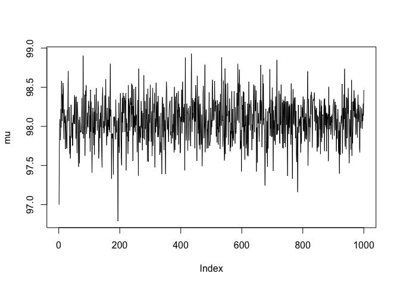
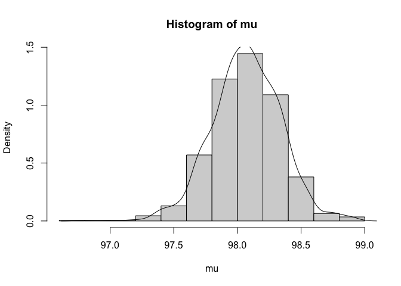
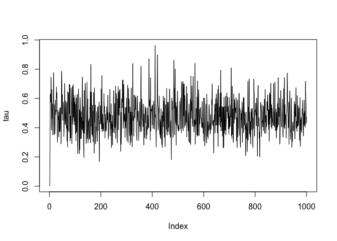
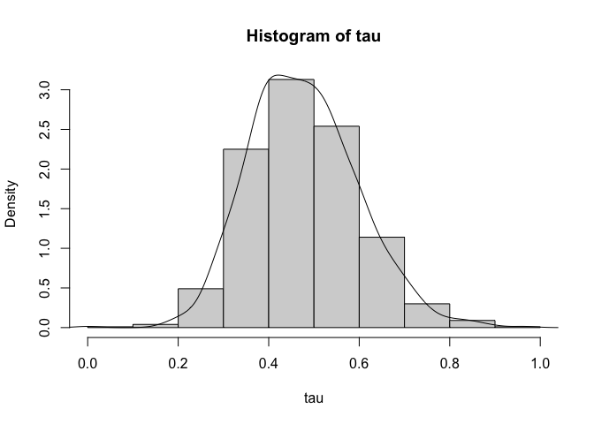

Sampling from a normal distribution:

```r
mu0 <- 97
lambda0 <- 1
alpha0 <- 0.5
beta0 <- 0.5

xbar <- 98.1
sig2 <- 2.1
n <- 30

mu1 <- (lambda0*mu0+n*xbar)/(lambda0+n)
lambda1 <- lambda0+n
alpha1 <- n/2 + alpha0
beta1 <- n*sig2/2 + (n*lambda0*(xbar-mu0)^2)/(2*(lambda0+n)) + beta0

m <- 1000
mu <- numeric(m)
tau <- numeric(m)
mu[1] <- 97 # first value of mu
for(i in 2:m) {   
  tau[i] <- rgamma(1, alpha1 + 1/2, 0.5*lambda1*(mu[i-1] - mu1)^2 + beta1)
  mu[i]  <- rnorm(1, mu1, sqrt(1/(lambda1*tau[i])))
}
```


```r
plot(mu, type = "l")
```

<!-- -->

```r
hist(mu, freq = F)
d <- density(mu)
x <- seq(min(mu), max(mu))
lines(d$x, d$y)
```

<!-- -->


```r
plot(tau, type = "l")
```

<!-- -->

```r
hist(tau, freq = F)
d <- density(tau)
x <- seq(min(tau), max(tau))
lines(d$x, d$y)
```

<!-- -->

# Now do some testing

```r
k <- 5
matmu <- matrix(NA,nrow = m, ncol = k)
mattau <- matrix(NA,nrow = m, ncol = k)
#the odd columns will be tau, the even columns will be mu
for(j in 1:k){
  mu <- numeric(m)
  tau <- numeric(m)
  mu[1] <- 97 # first value of mu
  tau[1] <- 0
  for(i in 2:m) {   
    tau[i] <- rgamma(1, alpha1 + 1/2, 0.5*lambda1*(mu[i-1] - mu1)^2 + beta1)
    mu[i]  <- rnorm(1, mu1, sqrt(1/(lambda1*tau[i])))   
  }
  matmu[1:m,j] <- mu
  mattau[1:m,j] <- tau
}

bmu <- m/(k-1) * sum((mean(matmu[1:m])-mean(mean(matmu[1:m])))^2)
btau <-m/(k-1) * sum((mean(mattau[1:m])-mean(mean(mattau[1:m])))^2)
print(bmu)
```

```
## [1] 0
```

```r
print(btau)
```

```
## [1] 0
```

```r
means <-0
seq
```

```
## function (...) 
## UseMethod("seq")
## <bytecode: 0x7fd4c46b5868>
## <environment: namespace:base>
```

```r
for (i in 1:k){
  meansmu <- means + mean(matmu[1:m,i])
  meanstau <- means + mean(mattau[1:m,i])
}
meansmu <- meansmu/k
meanstau <- meanstau/k

sumsmu <- 0
sumstau <- 0
for (j in 1:k){
  sumsmu <- sumsmu + (mean(matmu[1:m,j]) - meansmu)^2
  sumstau <- sumstau + (mean(mattau[1:m,j]) - meanstau)^2
  
}
bmu <- m/(k-1) * sumsmu
btau <- m/(k-1) * sumstau
print(bmu)
```

```
## [1] 7691966
```

```r
print(btau)
```

```
## [1] 180.239
```


```r
innnersumsmu <- numeric(2)
innersumtau <- numeric(20)
innersumsmu <- 0
innersumst <- 0

for(i in 1:m){
    innersumsmu[i] <- (matmu[i,j] - mean(matmu[1:m,j]))^2
    innersumst[i] <- (mattau[i,j] - mean(mattau[1:m,j]))^2
}
innersummu <- sum
  
print(length(innersumsmu))
```

```
## [1] 1000
```

```r
print(length(innersumtau))
```

```
## [1] 20
```

```r
wmu <- 1/(k*(m-1)) * sum(innersumsmu)
wtau <- 1/(k*(m-1)) * sum(innersumst)
print(wmu)
```

```
## [1] 0.01399276
```

```r
print(wtau)
```

```
## [1] 0.003027381
```


