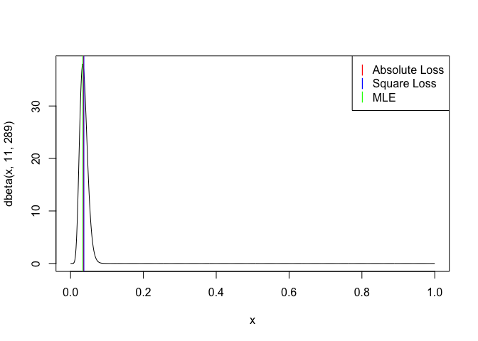
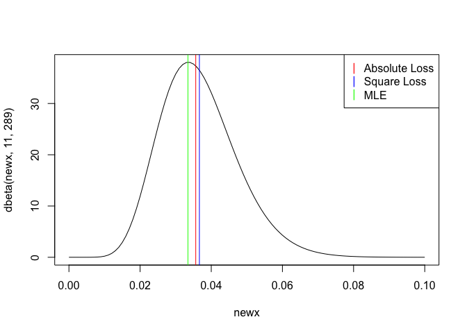
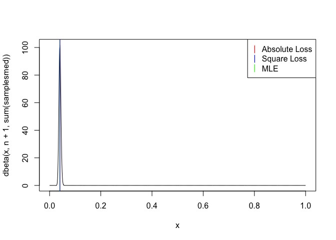
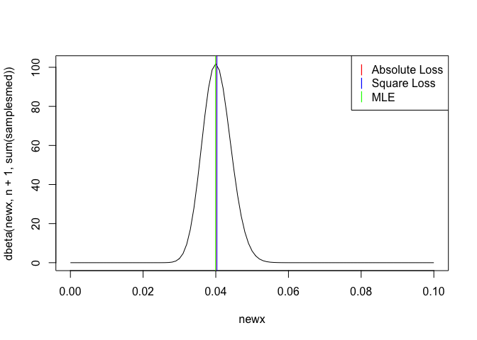
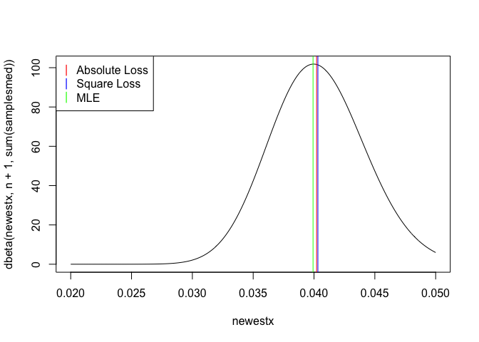

## Problem 6
### zoomed out

```r
x <- seq(0,1,0.001)
y <- seq(0,3,0.01)

plot(x, dbeta(x,11,289), type = "l")
abline(v = qbeta(0.5,11,289), col = "red")
abline(v = 11/(288+12), col = 'blue')
abline(v = 10/(288+11), col = 'green')
legend("topright", legend = c("Absolute Loss",'Square Loss','MLE'), pch = "|", col = c('red','blue','green'))
```

<!-- -->

### zoom in

```r
newx <- seq(0,0.1,0.001)
plot(newx, dbeta(newx,11,289), type = "l")
abline(v = qbeta(0.5,11,289), col = "red")
abline(v = 11/(288+12), col = 'blue')
abline(v = 10/(288+11), col = 'green')
legend("topright", legend = c("Absolute Loss",'Square Loss','MLE'), pch = "|", col = c('red','blue','green'))
```

<!-- -->

## Problem 7
### zoomed out


```r
n <- 100
samplesmed <- rgeom(n,11/300) # take the sample with the MLE estimate for theta

plot(x, dbeta(x,n+1,sum(samplesmed)), type = "l")
abline(v = qbeta(0.5,n+1,sum(samplesmed)), col = "red") #absolute loss
abline(v = n/(sum(samplesmed)+n+2), col = 'green') #MLE estimate
abline(v = (n+1)/(sum(samplesmed)+n+2), col = 'blue') #bayes square loss estimate
legend("topright", legend = c("Absolute Loss",'Square Loss','MLE'), pch = "|", col = c('red','blue','green'))
```

<!-- -->

### slight zoom in

```r
plot(newx, dbeta(newx,n+1,sum(samplesmed)), type = "l")
abline(v = qbeta(0.5,n+1,sum(samplesmed)), col = "red") #absolute loss
abline(v = (n+1)/(sum(samplesmed)+n+2), col = 'blue') #bayes square loss estimate
abline(v = n/(sum(samplesmed)+n+2), col = 'green') #MLE estimate
legend("topright", legend = c("Absolute Loss",'Square Loss','MLE'), pch = "|", col = c('red','blue','green'))
```

<!-- -->

### big zoom in

```r
newestx <- seq(0.02,0.05,0.0001)
plot(newestx, dbeta(newestx,n+1,sum(samplesmed)), type = "l")
abline(v = qbeta(0.5,n+1,sum(samplesmed)), col = "red") #absolute loss
abline(v = n/(sum(samplesmed)+n+2), col = 'green') #MLE estimate
abline(v = (n+1)/(sum(samplesmed)+n+2), col = 'blue') #bayes square loss estimate
legend("topleft", legend = c("Absolute Loss",'Square Loss','MLE'), pch = "|", col = c('red','blue','green'))
```

<!-- -->

