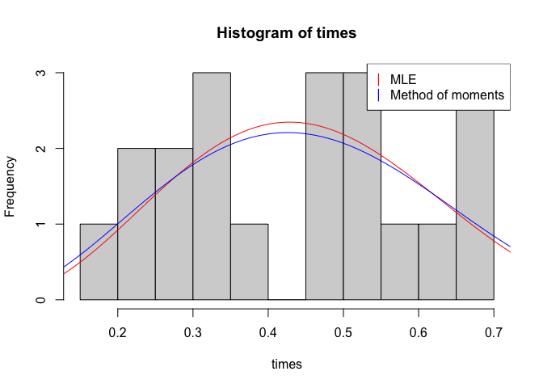

```r
library(rootSolve)
times <- read.csv("/Users/henryjones/Desktop/Math_CC/MA_417/times.csv")
times = times$x
newxbar = mean(times)
sighat = var(times)
```
## The method of moments

```r
ahat = newxbar*((newxbar *(1-newxbar))/sighat -1)
betahat = (1-newxbar)*((newxbar *(1-newxbar))/sighat -1)
print('method of moments estimates')
```

```
## [1] "method of moments estimates"
```

```r
print(ahat)
```

```
## [1] 3.554313
```

```r
print(betahat)
```

```
## [1] 4.441891
```


## The maximum likelihood estimator

```r
set.seed(8)
n <- length(times)
fnew <- function(y){
  c(n*digamma(y[1]+y[2]) - n* digamma(y[1]) + sum(log(times)), n*digamma(y[1]+y[2]) - n * digamma(y[2]) + sum(log(1-times)))
}
newexes <- seq(0,1,by = 0.001)
newsol <- multiroot(fnew,start = c(2,2))
hist(times,breaks=10)
lines(newexes,dbeta(newexes,newsol$root[1], newsol$root[2]),col = 'red')
lines(newexes,dbeta(newexes,ahat,betahat), col = 'blue')
legend("topright", legend = c("MLE",'Method of moments'), pch = "|", col = c('red','blue','green'))
```

<!-- -->

```r
print('new MLE estimates')
```

```
## [1] "new MLE estimates"
```

```r
trueahat <- newsol$root[1]
truebhat <- newsol$root[2]
print(trueahat)
```

```
## [1] 3.988659
```

```r
print(truebhat)
```

```
## [1] 4.988091
```
## Non-parametric standard error estimates


```r
f1 <- function(y,newsamp){
  c(n*digamma(y[1]+y[2]) - n* digamma(y[1]) + sum(log(newsamp)), n*digamma(y[1]+y[2]) - n * digamma(y[2]) + sum(log(1-newsamp)))
}

#MLE standard error
avect <- numeric(n)
bvect <- numeric(n)
for(i in 1:1000){
  samp <- sample(times, n, replace=T)
  f1 <- function(y){
    c(n*digamma(y[1]+y[2]) - n* digamma(y[1]) + sum(log(samp)), n*digamma(y[1]+y[2]) - n * digamma(y[2]) + sum(log(1-samp)))
  }
  sol <- multiroot(f1,start = c(1,1))
  avect[i] <- sol$root[1]
  bvect[i] <- sol$root[2]
}

print('standard error for MLE paramters')
```

```
## [1] "standard error for MLE paramters"
```

```r
print(sqrt(var(avect)))
```

```
## [1] 1.154412
```

```r
print(sqrt(var(bvect)))
```

```
## [1] 1.479494
```

## 95% confidence intervals for MLE parameters

```r
print('CI for MLE alpha')
```

```
## [1] "CI for MLE alpha"
```

```r
print(quantile(avect,0.025))
```

```
##     2.5% 
## 2.922868
```

```r
print(quantile(avect,0.9725)) 
```

```
##   97.25% 
## 7.388597
```

```r
print('CI for MLE beta')
```

```
## [1] "CI for MLE beta"
```

```r
print(quantile(bvect,0.025))
```

```
##    2.5% 
## 3.65733
```

```r
print(quantile(bvect,0.9725))
```

```
##   97.25% 
## 9.006351
```

## The method of moments estimates

```r
avectmm <- numeric(n)
bvectmm <- numeric(n)
for(i in 1:1000){
  samp <- sample(times, n, replace=T)
  xbar <- mean(samp)
  vhat <- var(samp)
  ahat = xbar*((xbar *(1-xbar))/vhat -1)
  betahat = (1-xbar)*((xbar *(1-xbar))/vhat -1)
  avectmm[i] <- ahat
  bvectmm[i] <- betahat
}
print('method of moments estimates')
```

```
## [1] "method of moments estimates"
```

```r
print(sqrt(var(avectmm)))
```

```
## [1] 1.088669
```

```r
print(sqrt(var(bvectmm)))
```

```
## [1] 1.282205
```

### 95% confidence intervals for method of momemts parameters

```r
print('CI for MM alpha')
```

```
## [1] "CI for MM alpha"
```

```r
print(quantile(avectmm,0.025))
```

```
##     2.5% 
## 2.435558
```

```r
print(quantile(avectmm,0.9725))
```

```
##   97.25% 
## 6.401336
```

```r
print('CI for MM beta')
```

```
## [1] "CI for MM beta"
```

```r
print(quantile(bvectmm,0.025))
```

```
##     2.5% 
## 3.075294
```

```r
print(quantile(bvectmm,0.9725))
```

```
##   97.25% 
## 7.916625
```

## Prametric Boostrap error estimates and quantiles
### MLE standard error

```r
avect <- numeric(n)
bvect <- numeric(n)
for(i in 1:1000){
  samp <- rbeta(n,trueahat,truebhat)
  f1 <- function(y){
    c(n*digamma(y[1]+y[2]) - n* digamma(y[1]) + sum(log(samp)), n*digamma(y[1]+y[2]) - n * digamma(y[2]) + sum(log(1-samp)))
  }
  sol <- multiroot(f1,start = c(1,1))
  avect[i] <- sol$root[1]
  bvect[i] <- sol$root[2]
}

print('standard error for MLE paramters param')
```

```
## [1] "standard error for MLE paramters param"
```

```r
print(sqrt(var(avect)))
```

```
## [1] 1.610049
```

```r
print(sqrt(var(bvect)))
```

```
## [1] 2.029556
```

### 95% confidence intervals for MLE parameters

```r
print('CI for MLE alpha param')
```

```
## [1] "CI for MLE alpha param"
```

```r
print(quantile(avect,0.025))
```

```
##     2.5% 
## 2.476336
```

```r
print(quantile(avect,0.9725)) 
```

```
##   97.25% 
## 8.559181
```

```r
print('CI for MLE beta param')
```

```
## [1] "CI for MLE beta param"
```

```r
print(quantile(bvect,0.025))
```

```
##     2.5% 
## 3.056187
```

```r
print(quantile(bvect,0.9725))
```

```
##   97.25% 
## 10.87503
```

## Method of moments estimates

```r
avectmm <- numeric(n)
bvectmm <- numeric(n)
for(i in 1:1000){
  samp <- rbeta(n,trueahat,truebhat)
  xbar <- mean(samp)
  vhat <- var(samp)
  ahat = xbar*((xbar *(1-xbar))/vhat -1)
  betahat = (1-xbar)*((xbar *(1-xbar))/vhat -1)
  avectmm[i] <- ahat
  bvectmm[i] <- betahat
}
```

## Parametric standard error for method of moments estimates

```r
print('method of moments standar error param')
```

```
## [1] "method of moments standar error param"
```

```r
print(sqrt(var(avectmm)))
```

```
## [1] 1.641155
```

```r
print(sqrt(var(bvectmm)))
```

```
## [1] 2.072645
```

## 95% confidence intervals for method of moments parameters

```r
print('CI for MM alpha param')
```

```
## [1] "CI for MM alpha param"
```

```r
print(quantile(avectmm,0.025))
```

```
##     2.5% 
## 2.317754
```

```r
print(quantile(avectmm,0.9725))
```

```
##   97.25% 
## 8.381866
```

```r
print('CI for MM beta param')
```

```
## [1] "CI for MM beta param"
```

```r
print(quantile(bvectmm,0.025))
```

```
##     2.5% 
## 2.855589
```

```r
print(quantile(bvectmm,0.9725))
```

```
##  97.25% 
## 10.6101
```


