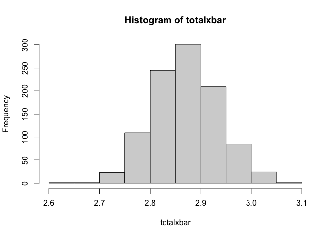
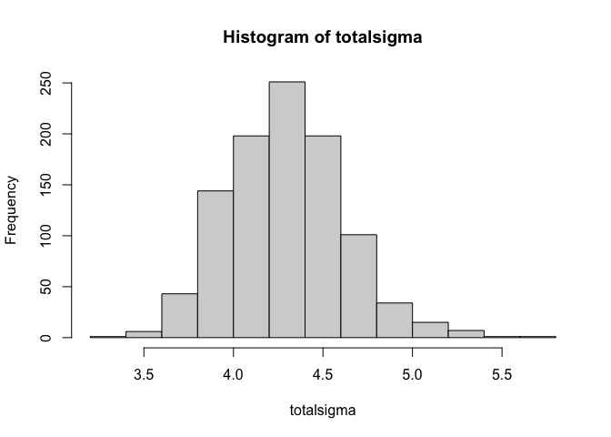
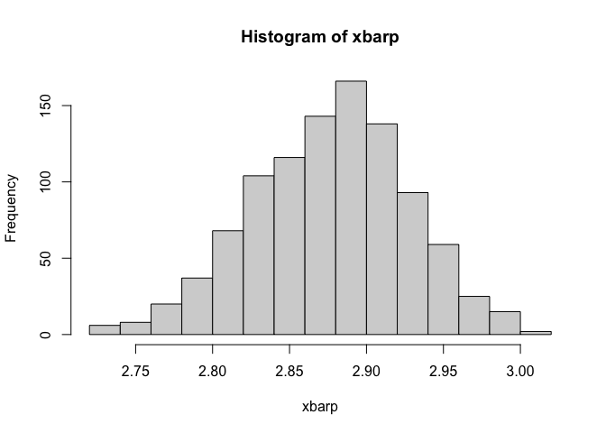
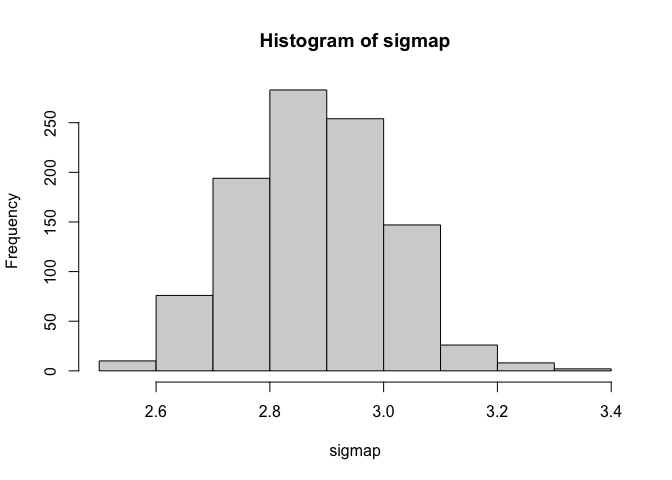

```r
results <- read.csv("/Users/henryjones/Desktop/Math_CC/MA_417/results_2019.csv")
results$goals <- results$away_score + results$home_score
print(length(results$goals) == length(results$away_score))
```

```
## [1] TRUE
```
### Construct a non-parametric bootstrap distribution for $\bar{x} \text{ and } \hat{\sigma}^2$.

```r
set.seed(8)
loops <- 1000
n <- length(results$goals)
totalxbar <- numeric(loops)
totalsigma <- numeric(loops)
for (i in 1:loops){
  randomtrial <- sample(results$goals, n, replace = T)
  totalxbar[i] <- mean(randomtrial)
  totalsigma[i] <- var(randomtrial)
}

print('standard error for xbar')
```

```
## [1] "standard error for xbar"
```

```r
print(sqrt(var(totalxbar)))
```

```
## [1] 0.06400647
```

```r
#hist(totalxbar, breaks = 10, xlim=c(0,max(totalxbar)))

print('standard error for sigmahat^2')
```

```
## [1] "standard error for sigmahat^2"
```

```r
print(sqrt(var(totalsigma)))
```

```
## [1] 0.3238725
```

```r
print(sd(totalsigma))
```

```
## [1] 0.3238725
```

```r
#hist(totalsigma)

hist(totalxbar)
```

<!-- -->

```r
hist(totalsigma)
```

<!-- -->

### Construct a parametric boostrap distribution for $\bar{x} \text{ and } \sigma^2$

```r
lam <- mean(results$goals)
xbarp <- numeric(loops)
sigmap <- numeric(loops)
for (i in 1:loops){
  randomtrial <- rpois(n,lam)
  xbarp[i] <- mean(randomtrial)
  sigmap[i] <- var(randomtrial)
}

print('standard error for xbar')
```

```
## [1] "standard error for xbar"
```

```r
print(sqrt(var(xbarp)))
```

```
## [1] 0.0502468
```

```r
hist(xbarp)
```

<!-- -->

```r
print('standard error for sigmahat^2')
```

```
## [1] "standard error for sigmahat^2"
```

```r
print(sqrt(var(sigmap)))
```

```
## [1] 0.1292234
```

```r
print(sd(sigmap))
```

```
## [1] 0.1292234
```

```r
hist(sigmap)
```

<!-- -->

```r
#plot(seq(-10,10,by=0.01),dpois(seq(-10,10, by=0.01),lam))
#hist(goals)

q1 <- quantile(totalxbar,0.025)
print(q1)
```

```
##     2.5% 
## 2.752294
```

```r
q2 <- quantile(totalxbar,0.975)
print(q2)
```

```
##    97.5% 
## 3.002641
```

