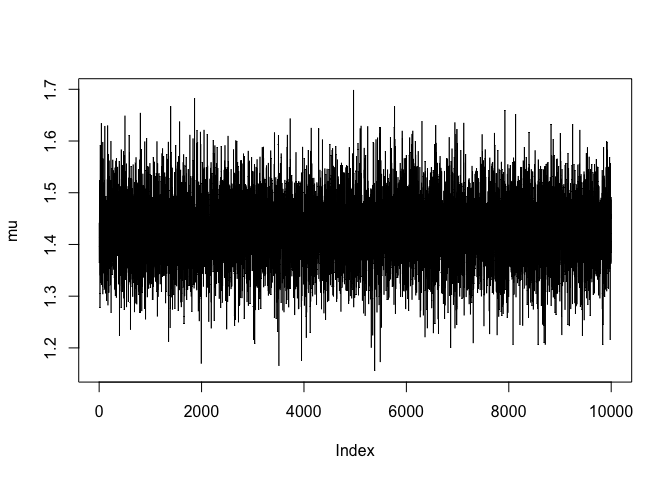
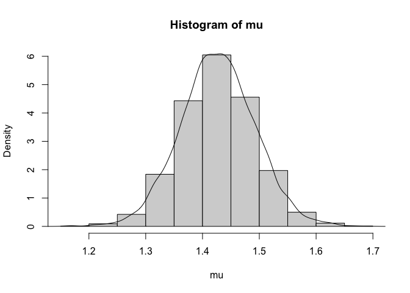
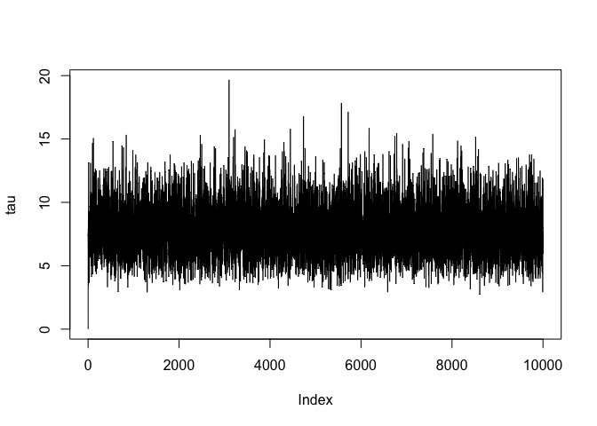
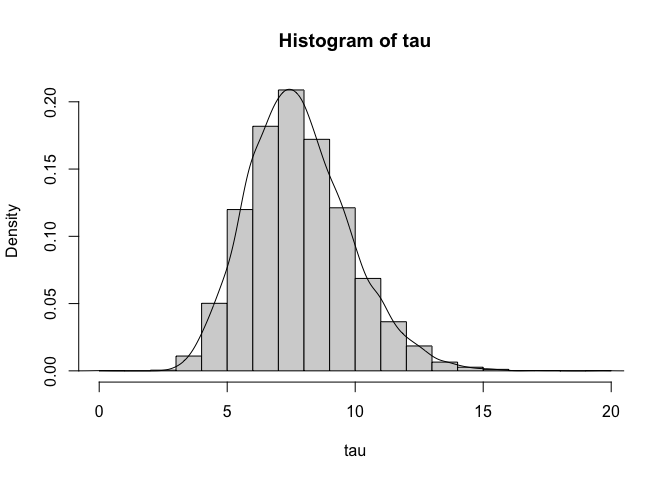

# Problem 12.5.5
Use the data consisting of 30 lactic acid concentrations
in cheese, 10 from Example 8.5.4 and 20 from Exercise 16
in Sec. 8.6. Fit the same model used in Example 8.6.2 with
the same prior distribution, but this time use the Gibbs
sampling algorithm described in Example 12.5.1. Simulate
10,000 pairs of $(\mu, \tau )$ parameters. Estimate the posterior
mean of $(\sqrt{\tau}\mu)^{−1}$, and compute the simulation standard error of the estimator.


```r
thirtypoint <- c(0.86, 1.53, 1.57, 1.81, 0.99, 1.09, 1.29, 1.78, 1.29, 1.58,1.68, 1.9, 1.06, 1.3, 1.52, 1.74, 1.16, 1.49, 1.63, 1.99,
              1.15, 1.33, 1.44, 2.01, 1.31, 1.46, 1.72, 1.25, 1.08, 1.25)
print(length(thirtypoint))
```

```
## [1] 30
```

### Using the prior, we find posterior hyper-parameters

```r
mu0 <- 1
lambda0 <- 1
alpha0 <- 0.5
beta0 <- 0.5

xbar <- mean(thirtypoint)
sig2 <- var(thirtypoint)

n <- length(thirtypoint)

mu1 <- (lambda0*mu0+n*xbar)/(lambda0+n)
lambda1 <- lambda0+n
alpha1 <- n/2 + alpha0
beta1 <- n*sig2/2 + (n*lambda0*(xbar-mu0)^2)/(2*(lambda0+n)) + beta0

print(mu1)
```

```
## [1] 1.427742
```

```r
print(lambda1)
```

```
## [1] 31
```

```r
print(alpha1)
```

```
## [1] 15.5
```

```r
print(beta1)
```

```
## [1] 1.976124
```

```r
trials <- 10000
mu <- numeric(10)
tau <- numeric(10)
mu[1] <- xbar # first value of mu
for(i in 2:trials) {   
  tau[i] <- rgamma(1, alpha1 + 1/2, 0.5*lambda1*(mu[i-1] - mu1)^2 + beta1)
  mu[i]  <- rnorm(1, mu1, sqrt(1/(lambda1*tau[i])))
}
```

# Now compute mean of $(\sqrt{\tau}\mu)^{−1}$ and the simulation standard error.

```r
objective <- mean(1/(sqrt(tau[1001:trials])*mu[1001:trials]))
print('this is the posterior mean')
```

```
## [1] "this is the posterior mean"
```

```r
print(objective)
```

```
## [1] 0.2576061
```

```r
inner <- 1/(sqrt(tau[1001:trials])*mu[1001:trials])
sderror <- sd(inner)/sqrt(trials-1000)
print('this is the standard error')
```

```
## [1] "this is the standard error"
```

```r
print(sderror)
```

```
## [1] 0.0003867517
```

## Some plots of our estimators

```r
plot(mu, type = "l")
```

<!-- -->

```r
hist(mu, freq = F)
d <- density(mu)
x <- seq(min(mu), max(mu))
lines(d$x, d$y)
```

<!-- -->

```r
plot(tau, type = "l")
```

<!-- -->

```r
hist(tau, freq = F)
d <- density(tau)
x <- seq(min(tau), max(tau))
lines(d$x, d$y)
```

<!-- -->
