## Exercise 1

Let X∼Beta(4,7).
 Find the following:

P(X<0.3)


```r
pbeta(0.3, 4, 7)
```

```
## [1] 0.3503893
```

P(X>0.2)


```r
1 - pbeta(0.2, 4, 7)
```

```
## [1] 0.8791261
```

The cutoff value for the lowest 1% realizations of X. That is, find x such that P(X≤x)=0.01.


```r
qbeta(.01, 4, 7)
```

```
## [1] 0.09321382
```
 
The cutoff value for the highest 1% realizations of Y. That is, find y such that P(Y≥y)=0.01.


```r
qbeta(.99, 4, 7)
```

```
## [1] 0.7028835
```


## Exercise 2

Use the same data-generating process as our previous example (that is, use a Bernoulli distribution with probability of success equal to 0.3) to generate many successes (1) and failures (0). Use 5 different sample sizes (make sure some sample sizes are small and some are large). Consider a uniform prior distribution (Beta(1,1)) for θ
 and, for each of the 5 sample sizes, plot the posterior distribution. What do you observe? How does the posterior distribution changes as the sample size increases/decreases? It may be helpful to plot all five posterior PDFs on the same plot.
 

```r
set.seed(8)
for(i in c(20, 40, 100, 1000, 10000)){
  samp <- rbinom(i, 1, 0.3);
  print(i)
  x <- seq(0,1,0.01)
  plot(x, dbeta(x, 1 + sum(samp), 1 + i - sum(samp)), type = "l")
  abline(v = 0.3, lty = "dashed")
}
```

```
## [1] 20
```

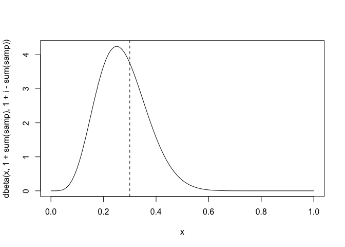<!-- -->

```
## [1] 40
```

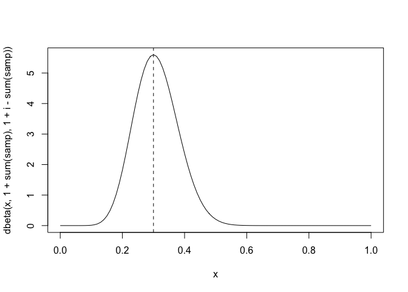<!-- -->

```
## [1] 100
```

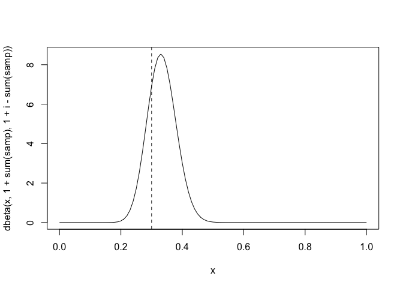<!-- -->

```
## [1] 1000
```

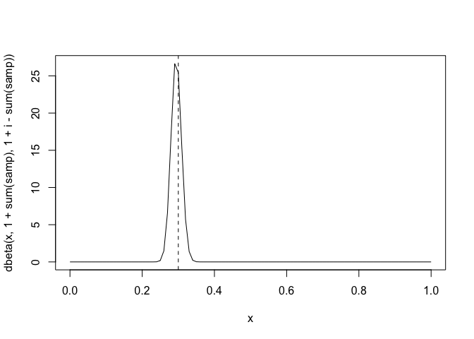<!-- -->

```
## [1] 10000
```

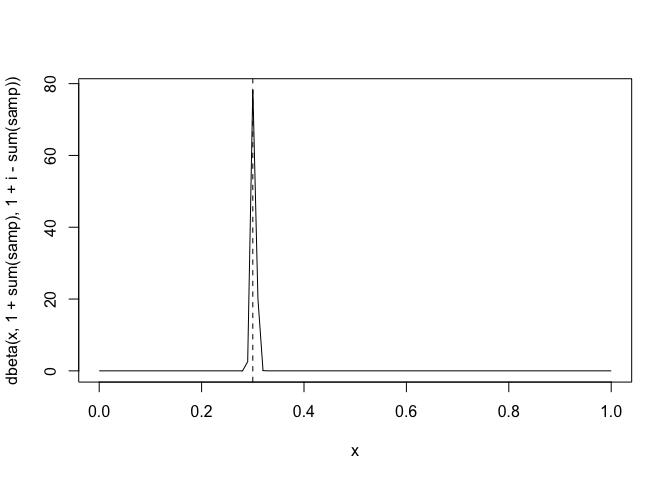<!-- -->

We observe that as sample size increases, the variance of our posterior decreases and our expected value of our posterior generally converges to 0.3, the parameter we are trying to estimate. 

## Exercise 3

Use the same data-generating process (Bernoulli distribution with probability of success equal to 0.3) to generate a sample of size 20. Use 5 different prior Beta distributions and, for each of these 5 priors, plot the posterior distribution. What do you observe? How does the posterior distribution change as the choice of priors change? It may be helpful to plot all five posterior PDFs on the same plot.


```r
set.seed(8)

for(i in c(1, 10, 50, 100, 150)){
  a <- 1
  b <- i
  print(a)
  print(b)
  samp <- rbinom(20, 1, 0.3);
  
  x <- seq(0,1,0.01)
  plot(x, dbeta(x, a + sum(samp), b + 20 - sum(samp)), type = "l")
  abline(v = 0.3, lty = "dashed")
}
```

```
## [1] 1
## [1] 1
```

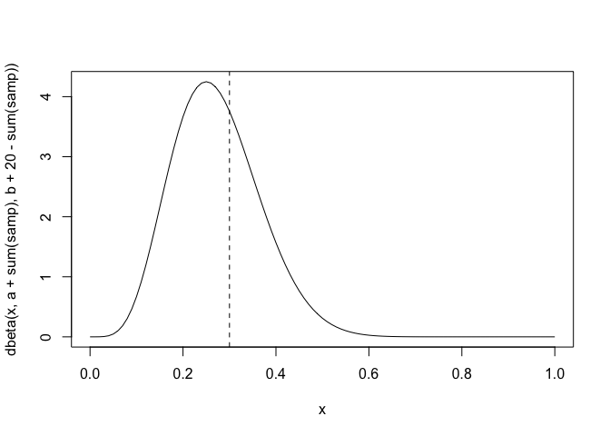<!-- -->

```
## [1] 1
## [1] 10
```

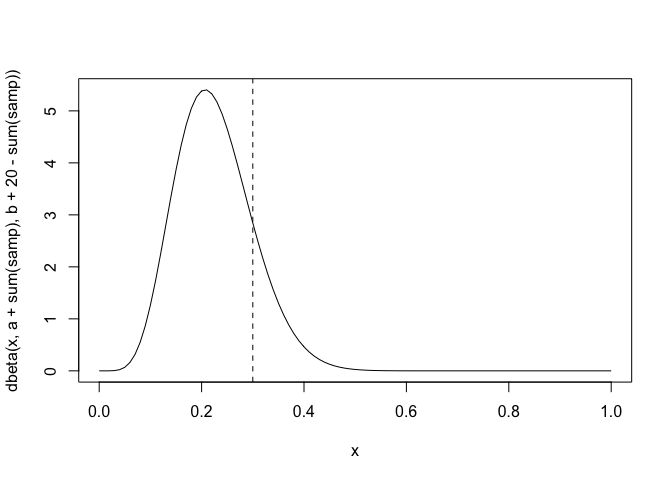<!-- -->

```
## [1] 1
## [1] 50
```

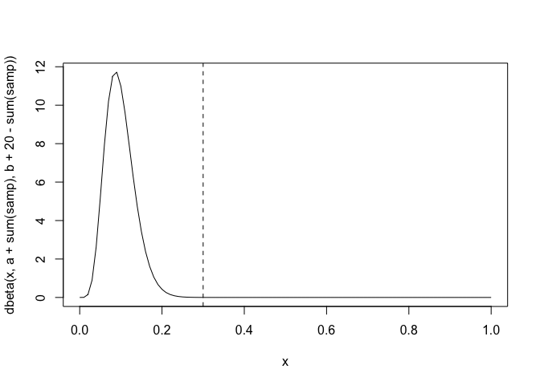<!-- -->

```
## [1] 1
## [1] 100
```

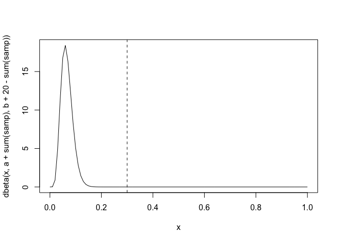<!-- -->

```
## [1] 1
## [1] 150
```

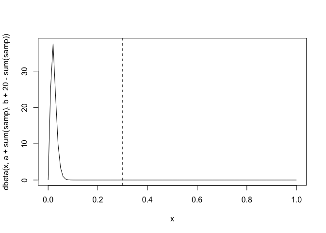<!-- -->

The print statement shows our alpha and beta selections for a Beta distribution of each prior. We hold alpha at one while we increase beta. We see that as we increase beta while holding alpha constant, the variance of our posterior decreases. However, the expected value of the posterior does not necessarily get closer to 0.3. This is likely because we are not changing our sample size and our sample size is not very large. Additionally, when beta is really big in comparison to the sample size in the prior, we see that the prior has a very large impact on our posterior. 

## Exercise 4

Repeat exercise 3 for n = 100.


```r
set.seed(8)

for(i in c(1, 10, 50, 100, 150)){
  a <- 1
  b <- i
  print(a)
  print(b)
  samp <- rbinom(100, 1, 0.3);
  
  x <- seq(0,1,0.01)
  plot(x, dbeta(x, a + sum(samp), b + 100 - sum(samp)), type = "l")
  abline(v = 0.3, lty = "dashed")
}
```

```
## [1] 1
## [1] 1
```

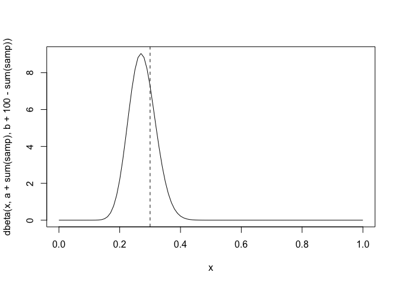<!-- -->

```
## [1] 1
## [1] 10
```

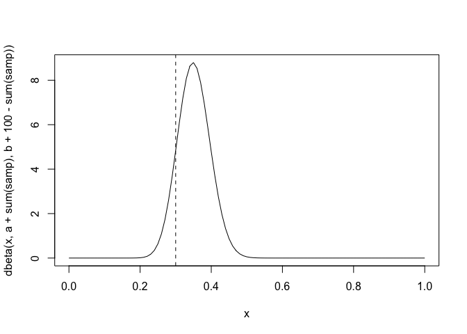<!-- -->

```
## [1] 1
## [1] 50
```

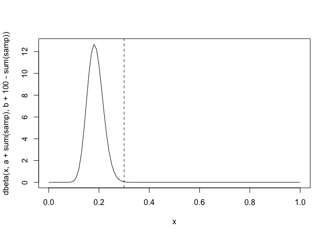<!-- -->

```
## [1] 1
## [1] 100
```

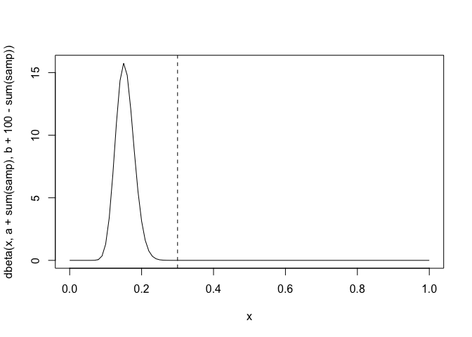<!-- -->

```
## [1] 1
## [1] 150
```

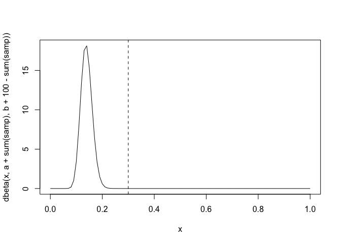<!-- -->

We observe a similar trend in terms of variance of our posterior distributions, seeing the variance decrease as beta increases and alpha is held constant. We do see the expected value of our posterior distributions moving closer to 0.3 at all values of beta. We do see less sensitivity to the prior with large beta values as we increase our sample size, resulting in the posterior expected value moving closer to 0.3 even with large beta values.

