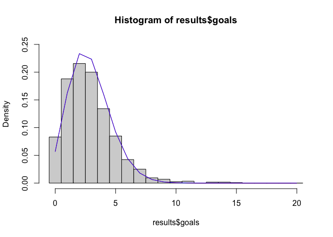
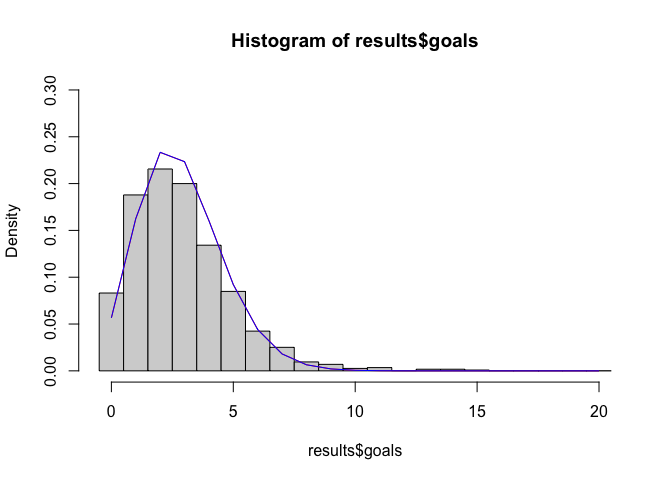
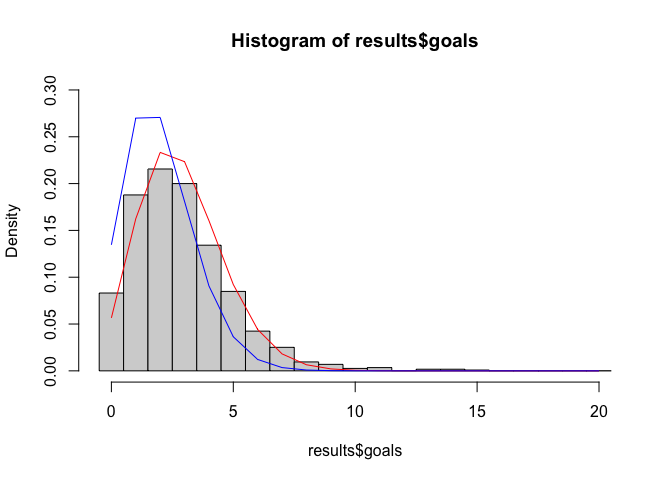
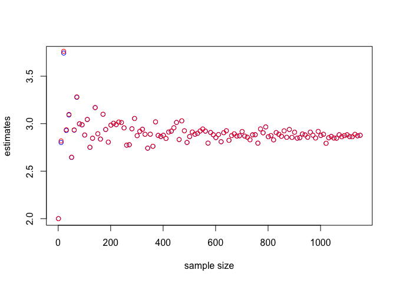
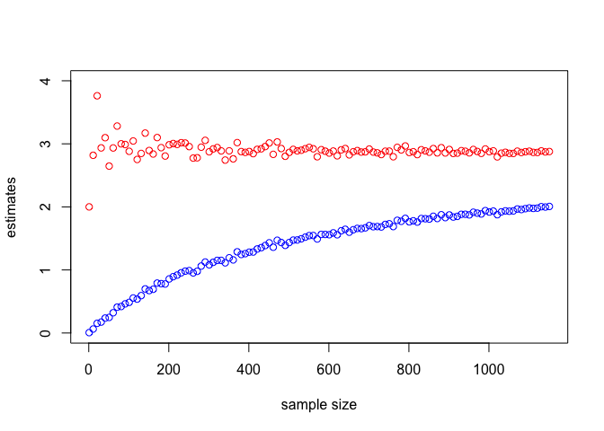

```r
results <- read.csv("/Users/henryjones/Desktop/Math_CC/MA_417/results_2019.csv")
results$goals <- results$home_score + results$away_score
```


## Exercise 1

Find the prior distribution of θ that matches the belief stated above.
 
We know that the for a Gamma distribution with parameters $\alpha$ and $\beta$, the expected value is $\frac{\alpha}{\beta}$ while the variance is $\frac{\alpha}{\beta^2}$. Thus we must solve the system $2 = \frac{\alpha}{\beta}$ and $3^2 = 9 = \frac{\alpha}{\beta^2}$. The second equation shows that $\alpha = 9 \beta ^2$ which when substituted into the first equation shows $\beta = \frac{2}{9}$ and $\alpha = \frac{4}{9}$.

## Exercise 2

Find the Bayesian estimate for θ using the prior distribution from exercise 1.

From Theorem 7.3.2, we know that given Poisson samples with a Gamma prior with parameters $\alpha$ and $\beta$, the posterior distribtion is a Gamma distribution with parameters $\alpha + \sum_{i=1}^n$ and $\beta + n$. Since this distribution is Gamma, and we are considering squared loss, we take the expected value of this distribution which we know is given by $\frac{\alpha + \sum_{i=1}^n}{\beta + n}$. We show this below.

 

```r
a = (4/9)
b = (2/9)
n = length(results$goals)

post_a = a + sum(results$goals)
post_b = b + n

estimate <- post_a / post_b
estimate
```

```
## [1] 2.872559
```

Our Bayesian estimate is 2.87 as it is just the expected value of our posterior gamma distribution.

## Exercise 3

Plot a poisson distribution on the data using the estimate for theta found in exercise 2, together with the poisson distribution using the MLE estimate.


```r
mle <- mean(results$goals)
x <- seq(0,20,1)
breaks <- seq(-0.5, 20.5, 1)
hist(results$goals, breaks = breaks, freq = FALSE, ylim = c(0,.25))
lines(x, dpois(x, mle), col = "red", pch = 16)
lines(x, dpois(x, estimate), col = "blue", pch = 16)
```

<!-- -->

These are both plotted, however, since they are so similar, you can only see the top line from the Bayes estimate.

## Exercie 4

Repeat exercises 2 and 3 for a different choice of prior distribution (use a “bad” prior).


```r
# we want first to be gamma (1,1), with mean = variance = 1 and the second to be gamma(1, 500) with mean = 1/500 and var = 1/500^2
alphas <- c(1, 1)
betas <- c(1, 500)
for (i in 1:2){
  a = alphas[i]
  b = betas[i]
  print(a)
  print(b)
  n = length(results$goals)
  
  post_a = a + sum(results$goals)
  post_b = b + n
  
  estimate <- post_a / post_b
  
  mle <- mean(results$goals)
  x <- seq(0,20,1)
  breaks <- seq(-0.5, 20.5, 1)
  hist(results$goals, breaks = breaks, freq = FALSE, ylim = c(0,.3))
  lines(x, dpois(x, mle), col = "red", pch = 16)
  lines(x, dpois(x, estimate), col = "blue", pch = 16)
}
```

```
## [1] 1
## [1] 1
```

<!-- -->

```
## [1] 1
## [1] 500
```

<!-- -->

Our first "bad prior" was not that bad with mean 1 and variance 1, so with the large amount of data it showed agreement with the mle. Our second "bad prior" was very bad with mean 1/500 and var 1/500^2 and it did not agree with the mle even with the large amount of data.

## Exercise 5

Assess the consistency of both estimators (Bayes and MLE) by investigating estimates for different sample sizes.


```r
set.seed(8)
mles <- c()
bayes <- c()
for (n in seq(1, length(results$goals), by=10)){
  a = (4/9)
  b = (2/9)
  
  keep_ind <- sample(1:length(results$goals), n)
  post_a = a + sum(results$goals[keep_ind])
  post_b = b + n
  
  estimate <- post_a / post_b
  
  mle <- mean(results$goals[keep_ind])
  
  mles <- append(mles, mle)
  bayes <- append(bayes, estimate)
}

plot(seq(1, length(results$goals), by=10), bayes, col='blue', ylab = "estimates", xlab = "sample size")
points(seq(1, length(results$goals), by=10), mles, col='red')
```

<!-- -->

MLEs are in red and bayes estimates are in blue.
We find that as the sample size increases both are mle and bayes estimate converge to the same theta. In fact, the mle and bayes estimate are extremely similar across all sample sizes as our prior is quite good.

Same thing with really bad prior:

```r
set.seed(8)
mles <- c()
bayes <- c()
for (n in seq(1, length(results$goals), by=10)){
  a = 1
  b = 500
  
  keep_ind <- sample(1:length(results$goals), n)
  post_a = a + sum(results$goals[keep_ind])
  post_b = b + n
  
  estimate <- post_a / post_b
  
  mle <- mean(results$goals[keep_ind])
  
  mles <- append(mles, mle)
  bayes <- append(bayes, estimate)
}

plot(seq(1, length(results$goals), by=10), bayes, col='blue', ylab = "estimates", xlab = "sample size", ylim = c(0,4))
points(seq(1, length(results$goals), by=10), mles, col='red')
```

<!-- -->

With a really bad prior, we see the bayes estimates become better as sample size increases, moving towards the mle. However, this is not enough data for how bad our prior is.
