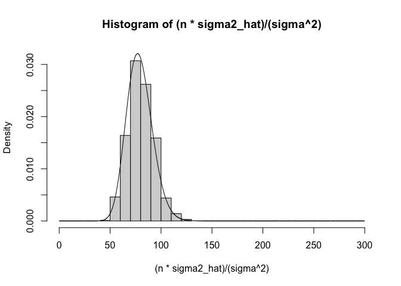
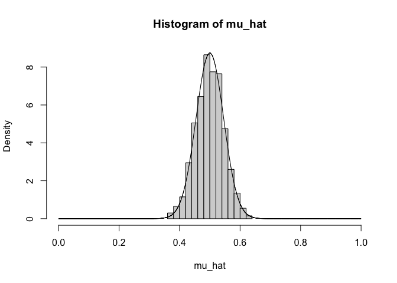
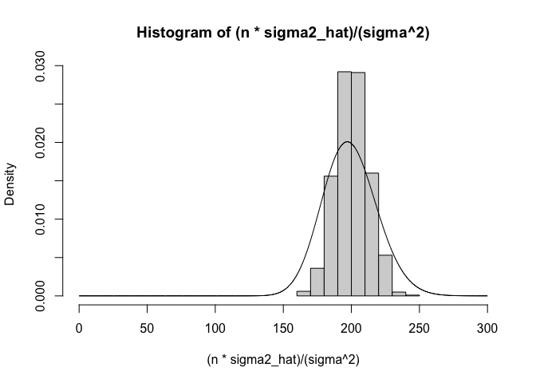

```r
mu <- -0.0001
sigma <- 0.0178
set.seed(8)
nsim <- 1000
mu_hat <- numeric(20)
sigma2_hat <- numeric(20)
for(i in 1:nsim){
  x <- rnorm(20, mu, sigma)
  mu_hat[i] <- mean(x)
  sigma2_hat[i] <- var(x)
}
hist(mu_hat)
```

<!-- -->

```r
hist(sigma2_hat)
```

<!-- -->


## Exercise 1

Do the shapes of the histograms above match the theoretical distributions that these estimators are supposed to have? Superimpose appropriate PDFs on the histograms.

mu_hat should follow N(mu, sigma2/n) and (n * sigma2_hat)/sigma_2 should follow chisq(n-1)


```r
x <- seq(-.02, .02, by=.0001)
hist(mu_hat, freq=FALSE, ylim=c(0,100))
lines(x, dnorm(x, mu, sqrt((sigma^2)/20)))
```

<!-- -->


```r
x <- seq(0, 60, by=.1)
hist((20*sigma2_hat)/(sigma^2), freq=FALSE, ylim = c(0, .07))
lines(x, dchisq(x, 19))
```

<!-- -->

These histograms do match the theoretical sampling distributions.

## Exercise 2

Experiment with different sample sizes. What happen to the shapes of the distributions as the sample size increases? Describe any noteworthy observations.


```r
for(n in c(20, 40, 80, 200)){
  print(n)
  mu <- -0.0001
  sigma <- 0.0178
  set.seed(8)
  nsim <- 1000
  mu_hat <- numeric(20)
  sigma2_hat <- numeric(20)
  for(i in 1:nsim){
    x <- rnorm(n, mu, sigma)
    mu_hat[i] <- mean(x)
    sigma2_hat[i] <- var(x)
  }
  x <- seq(-.015, .015, by=.0001)
  hist(mu_hat, freq=FALSE, ylim=c(0,max(dnorm(x, mu, sqrt((sigma^2)/n)))), xlim=c(min(x), max(x)))
  lines(x, dnorm(x, mu, sqrt((sigma^2)/n)))
  
  x <- seq(0, 300, by=.1)
  hist((n*sigma2_hat)/(sigma^2), freq=FALSE, ylim = c(0, max(dchisq(x, n-1))), xlim = c(min(x), max(x)))
  lines(x, dchisq(x, n-1))
}
```

```
## [1] 20
```

<!-- --><!-- -->

```
## [1] 40
```

<!-- --><!-- -->

```
## [1] 80
```

<!-- --><!-- -->

```
## [1] 200
```

<!-- --><!-- -->

For mu_hat we see the variance of the sampling distribution decrease as n increases. For the histograms showing (n * sigma2_hat) / sigma^2 we see the sampling distribution shifting to the right and becoming more symmetric about the mean. This makes sense as we know MLE sampling distributions approach normal distributions for large sample sizes.


## Exercise 3

We generate our random variables from a uniform distribution, Beta(1,1).


```r
for(n in c(20, 40, 80, 200)){
  print(n)
  a <- 1
  b <- 1
  mu <- a/(a + b)
  sigma <- sqrt((a*b) / ((a+b)^2 * (a + b + 1)))
  set.seed(8)
  nsim <- 1000
  mu_hat <- numeric(20)
  sigma2_hat <- numeric(20)
  for(i in 1:nsim){
    x <- rbeta(n, a, b)
    mu_hat[i] <- mean(x)
    sigma2_hat[i] <- var(x)
  }
  x <- seq(0, 1, by=.0001)
  hist(mu_hat, freq=FALSE, ylim=c(0,max(dnorm(x, mu, sqrt((sigma^2)/n)))), xlim=c(min(x), max(x)))
  lines(x, dnorm(x, mu, sqrt((sigma^2)/n)))
  
  x <- seq(0, 300, by=.1)
  hist((n*sigma2_hat)/(sigma^2), freq=FALSE, xlim = c(min(x), max(x)))
  lines(x, dchisq(x, n-1))
}
```

```
## [1] 20
```

<!-- --><!-- -->

```
## [1] 40
```

<!-- --><!-- -->

```
## [1] 80
```

<!-- --><!-- -->

```
## [1] 200
```

<!-- --><!-- -->

### Repeat of Exercise 1

Surprisingly, when we sample now from a uniform distribution (Beta(1,1)), we see ok agreement between the simulation results in the histograms and the the PDF of our predicted sampling distribution for mu_hat. However, for the sigma2_hat histogram we do not see very good agreement. The mean is fairly close, but the density is not high enough in the predicted chi squared pdf because the chi squared variance is too high.

### Repeat of Exercise 2

For mu_hat we see the variance of our sampling distribution decrease and there is good agreement between the actual estimates and the predicted normal distribution pdf. For the sigma2_hat histograms, we see the distributions become more normal as n increases. However, we do not see better agreement between the predicted sampling distribution and the actual estimates as n increases.


